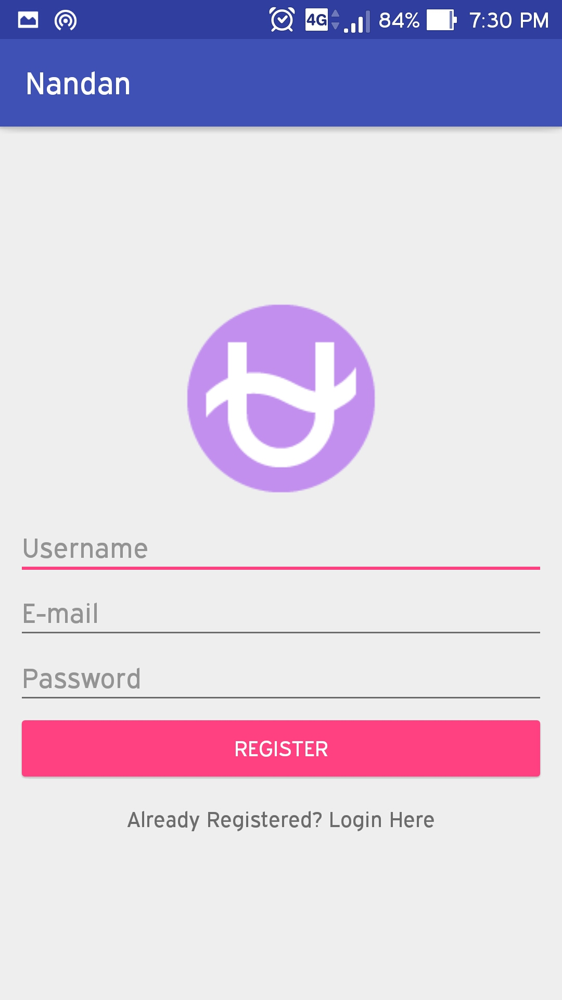
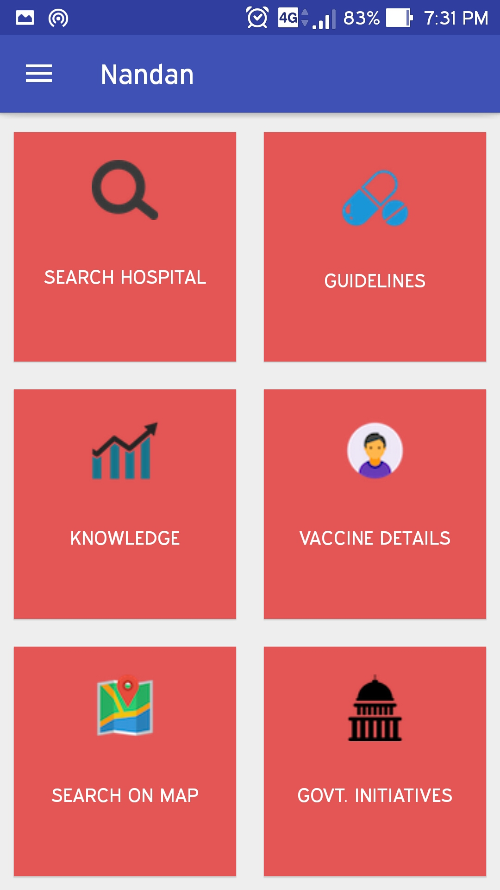
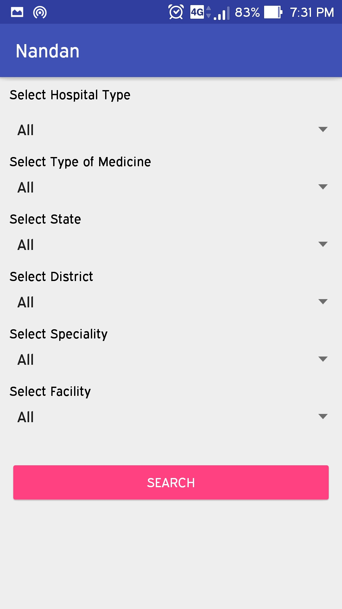
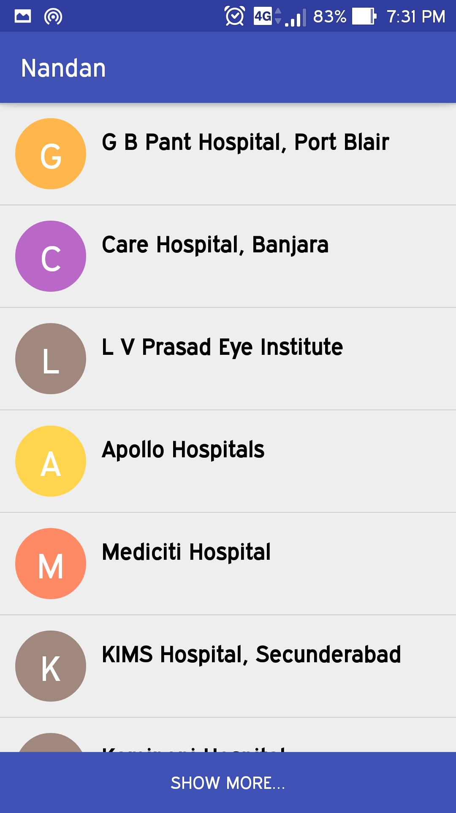
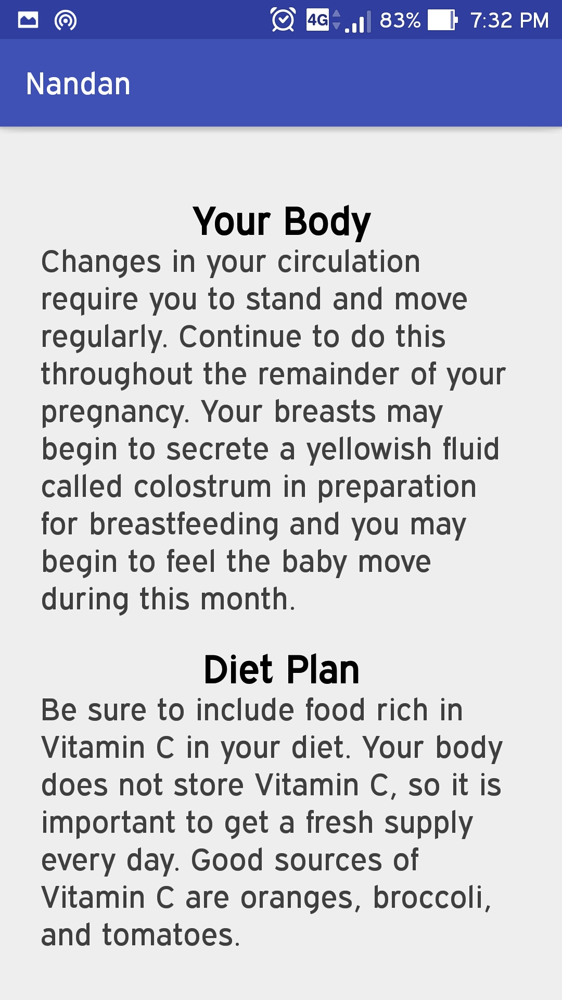
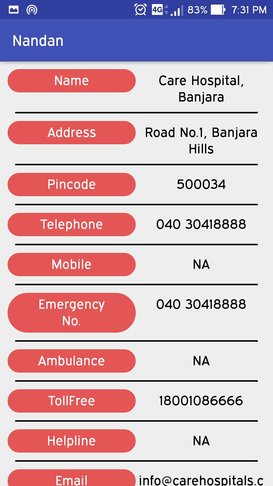
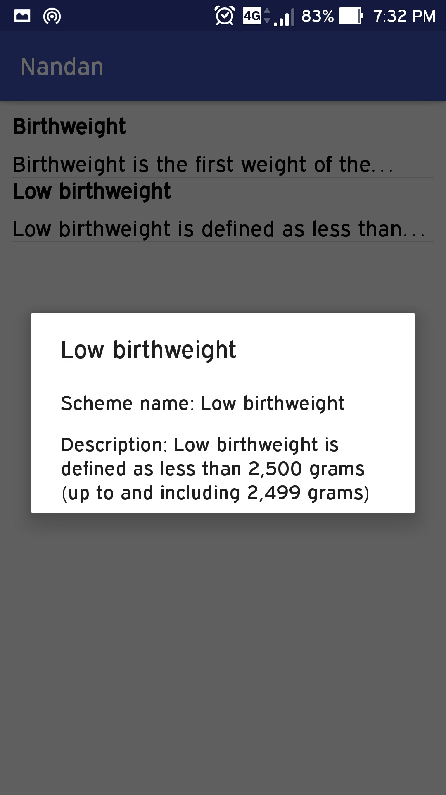
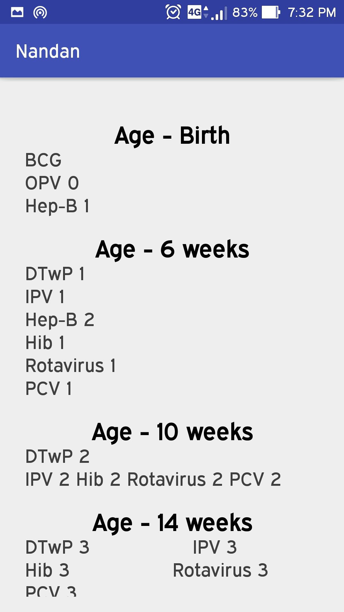
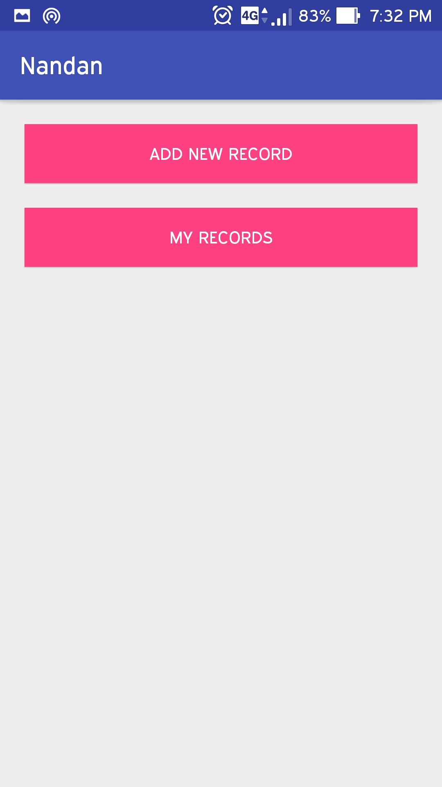

# Nandan
Android app made during Rural Development hackathon

• Nandan is a platform which provides all the necessary information to the mother. For example about preconception care and prenatal care. It gives information about the diet also what is good for the mother and for her child.

• It also shows all nearby child healthcare centers on the map with their details.

• Also there is a vaccination tracker which tracks the vaccination given to the child.

• A section is there which tells about recent policies of Government related to child care.

• A real time web platform for visualization of data.

# Backend

- Google Firebase Database and Storage

# Screenshots

  

 

 

  

